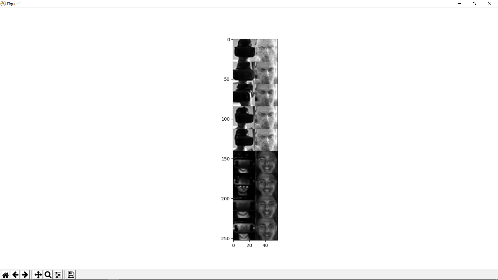
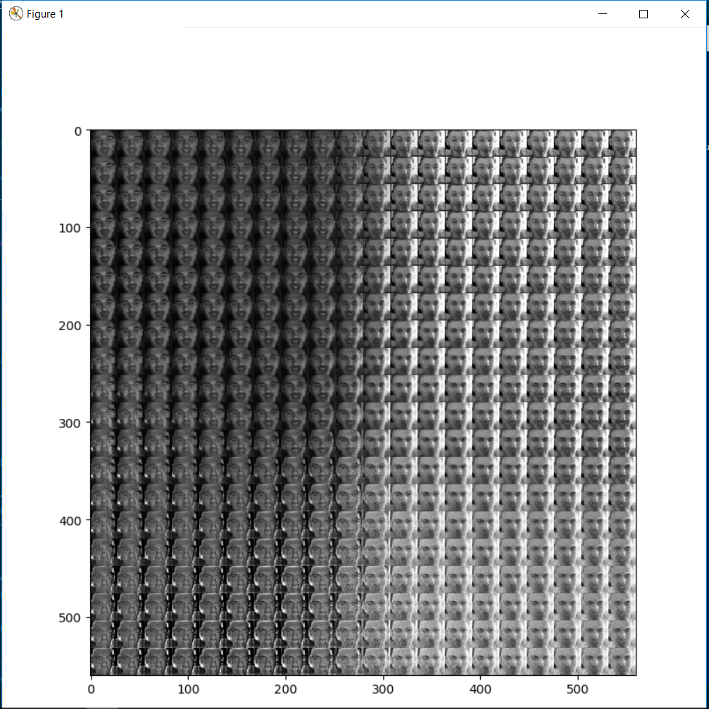

Remove VR headset from an image of a huma
===

Many thanks to https://github.com/aymericdamien/TensorFlow-Examples for the great code.

Autoencoders (AE) learn to reduce dimensionality of the input and than reconstruct it from the reduced space. Ideally, the reduced space reduces redundancy and removes noise.

This example aims to treat the VR headset as noise and there fore remove it in the reduced space and in the reconstructed image (output). Training is done on images of myself captured using an OpenCV script. Testing is done on images of myself wearing a VR headset.

Performance is not great. The model is basically only capable of generating from a hight brightness image of me wearing a headset a high brightness image of me without the headset and similar for low brightness. The face position and expression is not preserved.

Here are more examples of images generated from the two dimension latent space.

